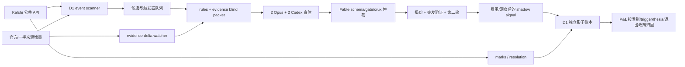

# D1 EVENT 事件研究盘：数据审计、方法设计与实现规格

> 席位：D1-codex5.6-sol（设计/数据）  
> 日期：2026-07-09 America/Denver；外部市场快照为 2026-07-10 04:41 UTC  
> 状态：设计完成，等待 Fable 5 架构审；本文件没有实现代码，也没有触碰实盘循环  
> 目标函数：费用、滑点后的真钱/影子 P&L。Brier 只留作概率诊断，不作主验收尺

## 0. 边界与审计轨迹

本席只做了以下动作：

- 用 SQLite URI `file:D:/Polymarket-Kelshi/data/ledger.db?mode=ro` 打开账本，并设置 `PRAGMA query_only=ON`。数据库处于 WAL 模式；没有执行写语句、checkpoint 或 schema migration。
- 只读检查 `config.yaml`、`CLAUDE.md`、`research/PROTOCOL.md`、`src/scanner.py`、`src/engine.py`、`src/pipeline.py`、`src/ledger.py` 和现有 research JSON。
- 通过 Kalshi 公共 API、公开访谈和论文做外部研究。没有登录 Kalshi 账户，没有访问 `D:\kalshi-secrets`。
- 没有运行 `tests/`，没有调用真实下单路径，没有修改任何 crypto 参数或实盘模块。
- 仓库中不存在用户所说的 `build_shared.txt`。本席以本轮用户消息的五条铁律和 `CLAUDE.md` 第 9 条为最高约束。

仓库原有未提交修改属于用户，本席没有触碰。本文件是唯一产出。

## 1. 先给结论

### 1.1 历史事件盘真钱 P&L 为负

按下文口径，真钱事件研究盘共有 11 笔：8 笔已实现、3 笔仍开仓。8 笔已实现合计投入成本 `$15.43`，净 P&L `-$3.98`，相对投入成本 `-25.8%`。账面胜率是 5/8，但盈利笔合计只赚 `$0.89`，亏损笔合计亏 `$4.87`，profit factor 约 `0.18`。这正说明胜率不能替代 P&L。

所有 8 笔已实现交易都在事件最终结算前通过 swing 平仓。事件盘目前有 **0 笔二元结算样本**。所以现有数据能回答“当前入场和退出组合有没有挣钱”，不能回答“四模型对最终事件的预测是否正确”。

### 1.2 类别结果

| 归一类别 | 已实现笔数 | 独立 ticker/题目 | 赢/亏 | 已实现 P&L | 投入成本 | 成本回报 | 未平仓 |
|---|---:|---:|---:|---:|---:|---:|---:|
| 政治 | 3 | 3 | 3/0 | `+$0.71` | `$4.53` | `+15.7%` | 1 笔，成本 `$2.54` |
| 经济 | 0 | 0 | 0/0 | `$0.00` | `$0.00` | n/a | 2 笔，成本 `$2.09` |
| 科技 | 3 | 2 | 1/2 | `-$4.44` | `$9.39` | `-47.3%` | 0 |
| 文娱 | 2 | 2 | 1/1 | `-$0.25` | `$1.51` | `-16.6%` | 0 |
| 合计 | 8 | 7 | 5/3 | `-$3.98` | `$15.43` | `-25.8%` | 3 笔，成本 `$4.63` |

目前只有政治为正，但 `n=3`，还不能推出“政治有稳定 edge”。科技的大部分亏损来自同一个 GPT 发布题重复入场两次，合计 `-$4.53`。这首先暴露的是同一 thesis 的重入控制和退出政策问题，不是三个独立科技判断同时失败。

### 1.3 方法结论

D1 应建成“研究资源分配器 + 单一事件证据状态机”，而不是“把高流动性 shortlist 全送进四模型”。职业玩家 Domer 的可借鉴做法是：扫很多市场，绝大多数不交易；先有自己的 baseline；只有看见价格、事件过程或相关合约不协调时才深挖；大仓前像记者一样查一手材料；新信息到来时按增量更新。

这对应四个工程变化：

1. scanner 从“流动性榜”改成“可执行性硬过滤 + 研究触发器排序”。
2. 研究输入从一段 intel 文本改成可追溯的 evidence packet，包含规则指纹、claim、时间和反证。
3. 四模型输出和 Fable 裁决改成机器可验的 schema。Fable 可以 veto，不能自己创造一个交易概率。
4. 新建 D1 影子账本，按 `event/thesis/research_version` 追踪实际与反事实 P&L，严禁复用生产 ledger 的写连接。

## 2. ledger.db 事件盘审计

### 2.1 纳入和排除口径

主样本只纳入 `mode='live'` 且属于四模型事件研究盘的交易。具体做法：

- 排除标题前缀 `favorite`、`shortcycle`、`weather`、`weather-fade`、`h10fav15m`、`h15maker`、`manual`。
- 排除结构腿 ticker：`KXBTCD`、`KXETHD`、`KXSOLD`、`KXXRPD`、`*15M*`、`KXHIGH*`。
- 额外排除 `KXBTCMAXMON`。它虽由 ensemble 研究过，标的是 BTC 方向，不属于 D1。
- `voided` 不算交易；`open` 单列，不把未实现损益猜成 0。
- `closed` 和 `settled` 都可形成已实现 P&L，但必须区分提前退出和二元结算。
- `paper` 单列，不能与真钱 P&L 混合。

这个口径得到 11 笔真钱事件单，10 个 ticker，9 个事件根。8 笔已实现涉及 7 个 ticker；3 笔未平仓。另有 1 笔 Alito 纸面交易。

### 2.2 真钱逐笔 P&L

“入场→退出/结算”列使用持有侧价格。P&L 是 ledger 已记录的费用后金额。

| id | 类别 | ticker / 题目 | 方向、张数 | 入场→退出/结算 | 状态与原因 | 净 P&L |
|---:|---|---|---:|---:|---|---:|
| 3 | 政治 | `KXALITOANNOUNCERETIRE-26JUN-AUG01`，Alito 8 月前宣布离任 | YES ×1 | `11c → 15c` | swing take-profit；未二元结算 | `+$0.02` |
| 7 | 文娱 | `KXRANKLIST1SONG-26JUL25-BEH`，Be Her 登顶 Billboard | YES ×7 | `8c → 4c` | swing stop-loss；未二元结算 | `-$0.34` |
| 123 | 科技 | `KXGPT-OPENB-26JUL10`，GPT-5.6+ 公开发布 | NO ×10 | `28c → 13c` | swing stop-loss；未二元结算 | `-$1.72` |
| 154 | 政治 | `KXTRUMPATTEND`，Trump 出席世界杯决赛 | YES ×2 | `88c → 92c` | swing take-profit；未二元结算 | `+$0.06` |
| 276 | 科技 | `KXLLM1-26JUL31-A`，Anthropic 月末 LMArena 第一 | YES ×3 | `81c → 86c` | swing take-profit；未二元结算 | `+$0.09` |
| 315 | 政治 | `KXPLATNERDROPOUT-26-JUL8`，Platner 截止日前退选 | NO ×5 | `51c → 67c` | swing take-profit；未二元结算 | `+$0.63` |
| 453 | 科技 | `KXGPT-OPENB-26JUL10`，同一 GPT 发布题再次入场 | NO ×18 | `21c → 7c` | swing stop-loss；未二元结算 | `-$2.81` |
| 572 | 文娱 | `KXRT-ODY-90`，The Odyssey 烂番茄高于 90 | NO ×3 | `29c → 35c` | swing take-profit；未二元结算 | `+$0.09` |

3 笔未平仓：

| id | 类别 | ticker / 题目 | 方向、张数 | 入场 | 成本 | ledger 状态 |
|---:|---|---|---:|---:|---:|---|
| 454 | 政治 | `KXMEDNOMJUL-26AUG01-TJAC`，Troy Jackson 成为 Maine 民主党参议员候选人 | NO ×5 | `49c` | `$2.54` | open |
| 571 | 经济 | `KXFEDDECISION-26JUL-H0`，7 月 Fed 维持利率 | NO ×3 | `21c` | `$0.66` | open |
| 659 | 经济 | `KXFEDDECISION-26JUL-H25`，7 月 Fed 加息 25bp | YES ×9 | `15c` | `$1.43` | open |

单独的纸面样本：id 1，Alito YES ×81，`11c → 15c`，swing P&L `+$1.95`。若把纸面和真钱机械相加，会得到 9 笔 `-$2.03`，但这个数没有经济意义，因为 81 张纸面仓位没有真钱资金约束。

### 2.3 能下什么结论，不能下什么结论

可以下的结论：

- 当前 D1 类事件单实际亏钱，`-$3.98`。
- 5/8 的盈利笔率没有变成正收益，原因是平均亏损远大于平均盈利。
- 当前最差 thesis 是 GPT 公开发布题。两次 rationale 的核心仍是“partner-only 不算 public”，但系统在第一次止损后再次下注，没有可查询的 `material_evidence_delta` 门。
- 政治类目前表现最好，但样本只有 3 笔。
- 现有“ensemble”报表混入 BTC 月内高点等非 D1 题，不能直接当事件盘 P&L。

不能下的结论：

- 不能说四模型比市场更会判断最终事件。二元结算样本是 0。
- 不能根据这 8 笔训练类别权重或模型权重。
- 不能断言科技本身没有 edge。`-$4.44` 中有 `-$4.53` 来自一个重复 thesis。
- 不能把 swing 止损后的 `result='stop_loss@...'` 当作 YES/NO 结果。

## 3. 现有 scanner、研究协议和定价流

### 3.1 scanner 当前做了什么

`config.yaml` 当前 scanner 参数：

| 参数 | 当前值 |
|---|---:|
| `max_pages` | 25 |
| `min_volume_24h` | 500 |
| `min_open_interest` | 1,000 |
| `max_spread_cents` | 6 |
| `min_price_cents` / `max_price_cents` | 4 / 96 |
| `min_days_to_close` / `max_days_to_close` | 0 / 45 |
| `shortlist_size` | 12 |

`src/scanner.py` 先用这些值过滤，再以

```text
liquidity_score = min(volume_24h, 20000)/20000
                + min(open_interest, 50000)/50000
                - spread_cents*0.05
```

排序，每个 event 最多留 2 个 market。

优点是简单、可复现、能砍掉死盘。缺点也很明确：

- score 只回答“好不好成交”，不回答“为什么值得研究”。大量 1c spread 的深盘都得到约 1.95，排序退化为并列。
- `domains` 仍包含 `Crypto`，会继续把已判定没有 LLM 方向优势的 BTC 题送进 D1 研究预算。
- `Sports` 不在当前 domains，尽管 D1 使命包含体育。
- 每个 event 允许 2 个合约，却没有事件级 exposure 或互斥合约一致性检查。当前 H0 和 H25 同属一个 Fed 决策事件。
- 直接信任交易所 category。Maine 民主党候选人市场被标成 `Economics`，会污染类别 P&L。
- 只看 top-of-book spread，不看目标张数的可执行深度。
- 没有“新信息”“规则/标题错配”“相关合约不一致”“临近催化剂”“社会注意力突增”等研究触发器。

### 3.2 四模型流程现状

`research/PROTOCOL.md` 规定的流程是合理的骨架：先读规则，收集情报，2 Opus + 2 Codex 盲估，Fable/Opus 仲裁，对 crux 做第二轮，交易前再验证突发信息。

实际机器接口只落实了一部分：

- `src/engine.py::decide()` 只接收 `q_claude`、`q_codex`、YES ask、NO ask 和 config。
- `q_all` 仅在 `_conviction_cap()` 中用于高确信尺寸，不是普通交易的必填校验。
- Fable 的 veto、rules 清晰度、source 新鲜度、盲估完整性都没有进入 engine 参数。
- `cmd_decide` 不检查 `sources`、证据时间、rules hash、research run id、CI 或 packet hash。
- `rationale` 是自由文本。engine 不会理解其中的 `NO-TRADE`。
- 14 个历史 research JSON 共 42 个 item，其中 12 个旧 item 缺 `q_all`。schema 纪律靠人工。

两个已发生的语义脱节例子：

- id 571 的 research rationale 写着 Fed H0 “no-trade”，但执行时新报价让纯数学 edge 过门，ledger 仍进入 open。
- id 572 的 Odyssey rationale 也写着 “NO-TRADE”，报价变化后 engine 放行，随后小赚退出。

这不必然说明 edge 计算错误。它说明“模型研究时的市场状态”和“执行时的机器状态”没有统一的数据契约。新系统应允许报价变化创造新 edge，但必须把它记录为新的 signal version，并检查证据是否仍新鲜，不能让旧文字与新动作共用一个无版本 rationale。

### 3.3 P&L 归因现状

`pipeline._lane_of()` 把所有未识别交易归为 `ensemble`。因此 D1 事件、BTC 月度事件题和其他四模型交易混在一起。ledger 还缺：

- `event_ticker`、归一类别、`thesis_id`、`research_run_id`、`forecast_version`；
- `rules_hash`、`evidence_hash`、`source_asof`、`quote_asof`；
- 四个估计者的独立结构化输出；
- arbiter 的机器 veto；
- 入场时目标张数的 orderbook VWAP；
- 提前退出后的最终事件结果和 hold-to-settlement 反事实 P&L。

## 4. 外部研究：职业玩家和系统化定价

### 4.1 Domer 的方法，及其工程翻译

Domer 在多次访谈中的方法相当一致：

- 他把预测市场称为可以靠研究击败对手的“慢动作扑克”。小额 gut bet 可以粗糙，大额要深入研究并找主题专家。[On Chain Times 原访谈](https://www.onchaintimes.com/a-chat-with-domer-the-1-trader-on-polymarket/)
- 他会扫数百个市场；大约九成价格看着合理，只有看到“不对劲”才开始研究。他先建立 baseline price，再随新信息修改，而不是追着新闻和人群走。[MetaMask 对 Domer 的访谈](https://metamask.io/en-GB/news/advanced-prediction-market-trading-strategies)
- 对教皇等低频事件，参与者几乎从同一起点出发，优势来自更快、更深、更准确地查历史档案和事件过程。规则细节、当地材料和程序瓶颈比泛泛观点更重要。[ChinaTalk 访谈](https://www.chinatalk.media/p/prediction-markets-101)
- 高流动性说明市场受到更多认真思考，通常更难打；低流动性的中等把握仓位又容易被困。流动性是可执行性和竞争强度的双重变量。
- 新账户、单一市场、价格不敏感的大额交易可能是 insider 信号，但多数大波动仍不是 insider。系统要标风险，不能把每次异动都解释成内幕。
- 规则争议可以压倒事件本身。Domer 举的例子包括“穿西装”和国际冲突定义。不可客观映射到官方 source 的市场，应跳过或降为观察。

工程上最值得复用的不是他的个人直觉，而是漏斗：

```text
扫很多市场 → 发现可解释的“不协调” → 建 baseline → 针对 crux 深研
          → 询问“对手为什么愿意成交” → 新证据到达才改价 → P&L 复盘
```

### 4.2 系统化事件定价可借鉴的方法

1. 先过“千里眼测试”。问题必须清楚到结算后不会争论谁对谁错。Good Judgment Project 的题目设计也要求这一点。[Mellers 等，2015](https://faculty.wharton.upenn.edu/wp-content/uploads/2015/07/2015---superforecasters.pdf)
2. 外部视角和内部视角分开。先定 reference class/base rate，再用本事件证据更新。当前 inside/outside persona 可保留，但输出必须强制列出 base rate 的分母、样本和相似性。
3. 把复合事件拆开。例如 `P(Troy Jackson 成为候选人) = P(现任退出) × P(退出后选 Jackson | 退出)`。这能暴露市场是否把 headline 的第一步当成了完整结果。
4. 用独立估计降低噪声。GJP 的训练、团队和选拔都提高了预测表现；后续 BIN 研究尤其强调减少判断噪声。[BIN 模型论文](https://faculty.wharton.upenn.edu/wp-content/uploads/2022/03/mnsc.2020.3882.pdf)
5. 聚合可在 log-odds 空间做，某些数据上还需要 extremize，因为不同估计者掌握的证据不完全重叠。[Baron 等，2014](https://faculty.wharton.upenn.edu/wp-content/uploads/2015/07/2015---two-reasons-to-make-aggregated-probability-forecasts_1.pdf) 但本系统目前只有 0 个事件二元结算，四个模型也高度相关，现阶段不应凭论文手调 extremization。先影子记录备选聚合器，等独立样本再用 P&L/校准共同裁决。
6. 市场价是证据，不是真理。理论和实证通常支持市场聚合信息，但在极端价格、交易约束、分歧大或风险偏好异常时会出现楔子。[Wolfers 与 Zitzewitz](https://www.nber.org/system/files/working_papers/w12083/w12083.pdf)
7. longshot 高估、favorite 低估是历史上常见的先验假设，不是 Kalshi D1 的自动交易规则。政治市场里的 wishful thinking 确实存在，但少数理性 marginal trader 也可能把价格拉回合理区间。[Iowa 市场研究](https://ideas.repec.org/a/aea/aecrev/v82y1992i5p1142-61.html) 因此“情绪重”只能提高研究优先级，不能直接生成方向。

### 4.3 Kalshi 当前品类：有量不等于有 LLM edge

本席用 Kalshi 官方 `GET /events` 公共接口，按现有 scanner 相同的 25 页上限抓取 5,000 个 open event、51,654 个 nested market。`volume_24h_fp` 和 `open_interest_fp` 都是合约数，不是美元。API 字段含义见 [Kalshi Market model](https://docs.kalshi.com/python-sdk/models/Market)，分页方法见 [Get Events](https://docs.kalshi.com/api-reference/events/get-events)。

“可执行候选”按当前配置硬过滤：24h volume ≥500、OI ≥1,000、spread ≤6c、YES 价格在 4c 到 96c 之间、0 到 45 天关闭、active 且非 provisional。

| 交易所类别 | 25 页内市场数 | 24h 合约量合计 | 通过当前硬过滤 | D1 判断 |
|---|---:|---:|---:|---|
| Sports | 23,229 | 8,402,416 | 167 | 流动性最强，但盘口受成熟 sportsbook/模型约束；只做官方伤病、阵容、资格等突发延迟，不做常规赛果猜测 |
| Elections | 11,503 | 3,646,765 | 12 | 主研究池；程序、退选、提名、地方材料适合深研，需防党派偏见和相关仓位 |
| Mentions | 880 | 1,768,450 | 101 | 情绪和流量都高，但可操纵、语义规则风险大；D1 默认排除 |
| Entertainment | 7,498 | 1,464,187 | 25 | 次主池；奖项、票房、榜单可用历史基率，明星/粉丝情绪重，须防早期 buzz 偏差 |
| Economics | 2,609 | 870,545 | 26 | 有量，但 Fed/CPI 等常有 CME、调查和 nowcast 强基准；以 cross-venue/条件分解为触发，不靠 LLM 泛评宏观 |
| Politics | 1,555 | 487,920 | 11 | 主研究池；任命、离任、法定时点、议会程序是 D1 最合适的形态 |
| Science and Technology | 717 | 266,105 | 17 | 可做离散发布/审批/里程碑；GPT 两次亏损说明必须严审 public/beta/规则语义和 rumor 来源 |
| Financials | 2,217 | 252,817 | 10 | 与 Economics 类似，优先找公开基准之间的不一致 |
| Companies | 445 | 59,686 | 0 | 当前无符合硬门的候选，保留观察 |
| World | 23 | 1,158 | 0 | 当前薄；且 insider/定义风险高，只在有客观官方 source 时研究 |

Pew 对更长区间的统计也显示 Kalshi 总量长期由体育主导，政治占比远低于 Polymarket。[Pew Research Center，2026](https://www.pewresearch.org/short-reads/2026/05/27/trading-volume-on-prediction-markets-has-soared-in-recent-months/) 这进一步说明 D1 不能按总量选品类。

建议优先级：

- A：Politics、Elections 的程序型/任命型/时限型市场。
- A-：Science and Technology、Companies 的客观里程碑市场，前提是 rules 和官方 source 清楚。
- B：Entertainment 中有历史基率、公开榜单或确定评分口径的市场。
- B/基准：Economics、Financials。大盘通常高效，只有 cross-venue outlier、条件概率不一致或突发信息延迟才进深研。
- C：Sports。量够，但常规赛果不体现 LLM 阅读优势；只接收新闻触发。
- 默认排除：Mentions、Social、主角可单方面控制结果、结算语义主观、长期 meme tail、crypto 方向和 weather。

这些是研究资源优先级，不是资金权重。类别能否挣钱仍要由 D1 影子 P&L 验证。

## 5. 目标架构



核心对象不是 ticker，而是：

```text
event → causal_cluster → thesis → research_version → signal_version → position/mark/result
```

这样才能处理：同一 event 多个互斥合约、不同 event 的强相关命题、止损后重入和新证据更新。

## 6. scanner v2 规格

### 6.1 隔离方式

新增 `src/event_scanner.py` 和 `src/event_cli.py`。第一阶段不改 `src/scanner.py`、`src/pipeline.py` 或 `config.yaml`。D1 配置放在新文件 `config_event_shadow.yaml`，或由 Fable 决定放入独立 namespace；不得借设计名义改现有实盘门。

### 6.2 公共 API 获取

复用：

- `KalshiPublic.iter_events()`、`normalize_market()`；
- 现有 scanner 的价格、volume、OI、spread、days-to-close 硬过滤；
- `taker_fee_usd()` 作为费用函数。

新增但不改旧 client 的能力：

- 事件增量拉取：利用官方 `min_updated_ts`，见 [Get Events](https://docs.kalshi.com/api-reference/events/get-events)。
- market orderbook 读取和目标张数的 executable VWAP。官方 orderbook 只返回 YES bids 和 NO bids，买方 ask 要做二元互补换算，见 [Get Market Orderbook](https://docs.kalshi.com/api-reference/market/get-market-orderbook)。
- 历史 trades/价格变化读取，供 volume velocity 和 mark 使用；不需要认证。

### 6.3 类别和排除规则

保存 `exchange_category`，另生成 `normalized_category`。归一规则至少覆盖：

- ticker/标题含候选人、党派、选举、提名、退选时，归到 Politics/Elections，修正 Maine 被标 Economics 的情况；
- crypto 价格、weather、mentions 明确隔离；
- Sports 只有 `news_trigger=true` 时进入研究队列；
- 无法确定时标 `unknown`，不得偷偷塞进 Economics。

默认 D1 include：`Politics, Elections, Economics, Financials, Science and Technology, Companies, Entertainment, Sports, World`。默认 exclude：crypto 方向、weather、mentions、social、主观/可控结果。

### 6.4 研究触发器

硬过滤后不再直接按 liquidity 排前 12。每个 market 保存以下 trigger，trigger 只决定研究优先级，不决定方向：

| trigger | 机器定义草案 | 为什么可能有 edge |
|---|---|---|
| `official_delta` | 上次 packet 后出现新的官方公告、日程、文件、投票、伤病或榜单数据 | 信息到价格之间可能有延迟 |
| `cross_contract_incoherence` | 同一互斥完备 event 的中价和偏离 1，或阈值 ladder 违反单调性；必须扣除 spread | 纯结构性不一致，研究成本低 |
| `cross_venue_gap` | Kalshi 与外部 venue 规则指纹等价，费用后价格仍明显分歧 | 市场参与者不同；规则不等价则禁止比较 |
| `headline_process_gap` | headline 只覆盖复合事件第一步，而结算要求多步；由 triage 输出分解 | 散户容易把“可能退出”当成“某人一定接任” |
| `deadline_boundary` | 结算时点、时区、法定截止或 `before/as of` 语义决定大部分概率 | 本地历史 Platner 交易的盈利来源之一 |
| `scheduled_catalyst` | 关闭前有确定发布、听证、会议、embargo、投票 | 可安排证据刷新和退出策略 |
| `attention_spike` | 价格/成交速度/社媒讨论突增，但官方 evidence state 未变 | 可能是情绪，也可能是 insider；只触发复核 |
| `tail_bias_candidate` | 低价长尾且 attention 高 | 仅作为 longshot 偏差假设，不能自动做 NO |

研究优先级采用可解释的分层，不在无数据时硬凑一组小数权重：

1. P0：`official_delta` 或费用后 `cross_contract_incoherence`。
2. P1：`headline_process_gap`、`deadline_boundary`、规则等价的 `cross_venue_gap`。
3. P2：有 `scheduled_catalyst` 且能找到客观 source。
4. P3：只有 attention/liquidity，没有明确研究 crux，留 watchlist，不调用四模型。

同层内按 intended size 的可执行成本、spread、close time 和 source 可得性排序。scanner 输出全部 feature，不能只输出总分。

### 6.5 去重和相关性

- 每个 event 默认只送 1 个“最佳表达”进入四模型，不再固定留 2 个。
- 多 outcome event 先构建完整概率向量，再选费用后 edge 最大且深度足够的表达。
- 生成 `causal_cluster_id`。例如 Platner 退选和替代候选人属于同一因果簇。
- 已有 open/shadow position、pending signal 或最近被 stop 的相同 `thesis_id` 必须出现在 candidate 上。
- 止损后重入要求 `material_evidence_delta=true` 或 rules 解释发生变化。单纯价格更便宜不算新 thesis。

### 6.6 Candidate 数据契约

```json
{
  "schema_version": "d1-candidate-v1",
  "scan_run_id": "uuid",
  "captured_at": "ISO-8601 UTC",
  "ticker": "KX...",
  "event_ticker": "KX...",
  "exchange_category": "Economics",
  "normalized_category": "Politics",
  "title": "...",
  "subtitle": "...",
  "close_time": "...",
  "rules_hash": "sha256",
  "quote": {"yes_bid": 0.47, "yes_ask": 0.48, "no_bid": 0.52, "no_ask": 0.53},
  "volume_24h": 1000.0,
  "open_interest": 5000.0,
  "intended_size_vwap": {"yes": 0.49, "no": 0.54, "contracts": 5},
  "triggers": ["headline_process_gap", "deadline_boundary"],
  "priority_tier": "P1",
  "causal_cluster_id": "maine-dem-nominee-2026",
  "existing_exposure": {"live": 0, "shadow": 1},
  "reject_reasons": []
}
```

## 7. 单一事件研究工程化

### 7.1 Blind evidence packet

四个估计者不能直接收到一堆 URL 摘要。`src/event_packet.py` 生成同一份、可哈希的 blind packet：

- `rules_primary` 和 `rules_secondary` 原文；官方结算 source；close/settlement 时区。
- `rules_hash` 和解析后的 `resolution_map`：YES 的必要条件、充分条件、平局/修订/撤回处理。
- reference class：样本定义、分母、观察窗和与本题的差异。
- decomposition tree：复合事件的条件概率节点。
- claims：每条 claim 有 `event_time`、`retrieved_at`、source tier、支持/反对方向、独立 source 数。
- contrary evidence、unknowns、scheduled catalysts、what would falsify。
- 本地语言/原始文件优先；转载要指回原始来源。
- `market_price_omitted=true`。packet 生成器在 blind 阶段拒绝 Kalshi、Polymarket、betting odds 等价格域名。

Source tier 建议：

- S0：结算指定 source、法律/监管文本、公司/政府原始公告、官方数据。
- S1：AP/Reuters 等原创报道、当事人可验证原话、完整访谈/听证。
- S2：行业媒体、地方媒体、可靠聚合。
- S3：匿名帖、社媒传言、二次摘要。S3 只能触发搜索，不能单独支撑交易。

### 7.2 四模型输出

四个盲估者都输出同一 schema：

```json
{
  "estimator_id": "opus-inside|opus-outside|codex-inside|codex-outside",
  "model": "exact model/version",
  "packet_hash": "sha256",
  "market_price_seen": false,
  "p_yes": 0.23,
  "ci80": [0.14, 0.34],
  "base_rate": {"p": 0.18, "reference_class": "...", "n": 42},
  "decomposition": [{"node": "A", "p": 0.5}, {"node": "B|A", "p": 0.46}],
  "key_drivers": ["claim-id-1"],
  "counterevidence": ["claim-id-4"],
  "assumptions": ["..."],
  "what_would_change_mind": ["..."],
  "invalid": false
}
```

数值检查：`0≤p≤1`、CI 包含 p、decomposition 可复算、packet hash 一致、四个 estimator_id 齐全。任何一项失败都不能进入 signal。

### 7.3 Fable 仲裁

Fable 做三件事：

1. schema 与研究覆盖审计；
2. 指定真正会改变 trade/no-trade 的 crux，并选择是否发起第二轮；
3. 给出机器可读 `trade_eligible`/`veto`。

Fable 不输出替代四模型的 `p_yes`，也不能用“我觉得更合理”把一笔无 edge 的交易创造出来。建议输出：

```json
{
  "arbiter": "fable-5",
  "packet_hash": "sha256",
  "rules_clear": true,
  "sources_fresh": true,
  "blind_integrity": true,
  "material_unknowns": [],
  "cruxes": ["A 是否在截止前发生"],
  "round2_required": true,
  "veto": false,
  "trade_eligible": true,
  "reason_codes": []
}
```

硬 veto：规则无法客观映射、官方 source 不可访问、四估计不完整、blind 泄价、关键 claim 只有 S3、主角可单方控制且 insider risk 无法管理、相关敞口超出新 D1 shadow 规则。

### 7.4 揭价和第二轮

第一轮落盘后才揭示：Kalshi 当前 bid/ask、目标张数 VWAP、相关合约、规则等价的外部 venue 价格。

第二轮每家族只派 1 个代表，必须以 delta 形式回答：

- 哪条新证据或市场信号改变了哪一节点；
- 更新前后 p；
- 若不更新，为什么市场价不是独立证据；
- 是否触发 PROTOCOL 的 factual-basis void。

继续保留当前半程锚定规则：没有事实基础错误时，家族终值不能只因看见市场价而把与市场的距离缩掉一半以上；若 packet 的关键事实被验证层推翻，原盲估作废，必须标 `blind_voided=true` 后重估。

### 7.5 聚合和 signal

兼容当前协议的 v1 聚合：

```text
q_opus  = mean(opus_inside, opus_outside) 或该家族合法的 round2 final
q_codex = mean(codex_inside, codex_outside) 或该家族合法的 round2 final
q_final = mean(q_opus, q_codex)
family_divergence = abs(q_opus - q_codex)
```

现阶段不做手工模型加权、不 extremize。原因是 D1 没有二元结算样本。影子账本可同时保存 arithmetic mean、logit pool、market blend 等反事实报价，未来在独立 thesis 上比较费用后 P&L。

signal 前机器门：

- Fable `trade_eligible=true` 且没有 veto；
- `family_divergence ≤ 0.10`，沿用现有门；
- 四个 q、rules hash、packet hash、quote timestamp 完整；
- evidence 没有过期或发生 material delta；
- 当前目标张数的 VWAP 重新计算费用后 edge；
- event/causal cluster/re-entry 门通过；
- rationale 中的动作由结构化 `recommended_action` 表达，不再解析自由文本。

然后才可复用 `engine.decide(q_opus, q_codex, yes_ask, no_ask, cfg_adapter)` 的纯数学部分。D1 adapter 必须把 top ask 换成 intended-size executable price，并把结果写入 shadow signal。第一阶段不得调用 `pipeline.cmd_decide()`，因为它会写生产 ledger 和生成 pending live order。

## 8. P&L 追踪设计

### 8.1 新建独立 shadow DB

建议文件 `data/event_shadow.db`。它与 `data/ledger.db` 分离；legacy importer 只能用 `mode=ro` 读生产账本。

建议表：

| 表 | 主键/关键字段 | 用途 |
|---|---|---|
| `scan_runs` | `scan_run_id, captured_at, config_hash` | 复现市场宇宙 |
| `candidates` | `scan_run_id, ticker, event_ticker, triggers, reject_reasons` | 研究漏斗分母 |
| `packets` | `packet_hash, rules_hash, source_asof, evidence_hash` | 证据版本 |
| `estimates` | `packet_hash, estimator_id, p_yes, ci, raw_json` | 四估计审计 |
| `arbitrations` | `packet_hash, arbiter, veto, reason_codes` | Fable 审计 |
| `signals` | `signal_id, thesis_id, research_version, q_final, executable_price, edge_net` | 可交易观点 |
| `shadow_positions` | `position_id, signal_id, side, contracts, entry_price, fees, policy` | 影子仓位 |
| `marks` | `position_id, ts, sellable_bid, exit_fee, evidence_hash` | 可实现 MTM，不用 mid |
| `resolutions` | `ticker, result, settled_at, source, rules_hash` | 最终 YES/NO |
| `pnl_attribution` | `position_id, realized_pnl, trigger, category, exit_reason` | 报表快照或 materialized view |
| `legacy_event_trades` | `ledger_id, imported_at, classification_version` | 只读重建本节 11 笔历史 |

所有写入用 append/version 语义。研究更新不能覆盖旧概率和旧 evidence。

### 8.2 P&L 口径

主指标：

- `realized_net_pnl`：退出/结算收入减入场成本、双边费用和实际滑点；
- `return_on_deployed_cost`；
- profit factor、平均盈利/平均亏损、最大回撤、turnover；
- 按 normalized category、trigger、source tier、family divergence、持有期、exit policy 分组；
- 按独立 `thesis_id` 计数，同时保留 trade count，防止重复下注把样本伪装变大。

辅助指标：

- 1h/6h/24h 的 sellable-bid edge capture；
- 最终结算后的 hold-to-settlement 反事实 P&L；
- 当前 swing、纯持有、evidence-triggered exit 三种政策的并行影子结果；
- Brier、market Brier、calibration slope，只作定价诊断。

MTM 必须用持有侧可卖 bid，再扣预计退出费。mid 只能做研究图，不能报作可实现 P&L。

### 8.3 退出和重入

当前 8 笔全是 swing，0 笔二元结算。D1 v1 不应直接把全局 `swing.stop_loss_frac=0.5` 当成已经验证的事件退出策略。实现时并行记录三条影子政策：

1. `hold_to_resolution`；
2. `current_swing_counterfactual`；
3. `evidence_state_exit`：只有 rules/evidence/thesis 改变或 Fable 复核撤销 trade eligibility 才退出。

任何真实上线前退出政策由 Fable 审后提案，涉及验收和资金的决定交用户。本规格不改现有 swing 参数。

重入规则：同一 `thesis_id` 被 stop 后，若 `evidence_hash` 未发生 material change，则新 signal 标 `reentry_blocked_same_thesis`。这直接防止 GPT 题的同论据二次亏损。

## 9. 给 Opus / Sonnet 的实现包

### 9.1 新模块

| 模块 | 责任 | 可复用 | 禁止 |
|---|---|---|---|
| `src/event_types.py` | dataclass/enum/schema version | 无 | 不依赖 live/ledger |
| `src/event_scanner.py` | 公共 API universe、硬过滤、trigger、归一类别、event 去重 | `KalshiPublic`, `normalize_market` | 不写 `data/candidates.json`，不改旧 scanner |
| `src/event_book.py` | 读取官方 orderbook，计算 intended-size VWAP | 官方 orderbook schema | 不发订单 |
| `src/event_packet.py` | rules 指纹、source/claim/decomposition blind packet | `cmd_rules` 的字段选择思路 | 不把价格域名放进 blind packet |
| `src/event_ensemble.py` | 校验四模型输出、家族聚合、Fable gate、round2 delta | `config.yaml ensemble` 只读 | 不调用生产 pipeline |
| `src/event_pricing.py` | 费用、VWAP、edge、signal；纯函数 | `taker_fee_usd`, `engine.decide` 数学逻辑 | 不写生产 ledger |
| `src/event_store.py` | `event_shadow.db` schema 和 append/version 存储 | SQLite | 不 import `ledger._conn()` |
| `src/event_pnl.py` | legacy 只读导入、marks、settle、P&L attribution | ledger schema 文档 | 不写 `ledger.db` |
| `src/event_cli.py` | 独立 shadow CLI | 上述新模块 | 没有 `execute-live` 子命令 |

函数级契约草案：

```python
def scan_event_universe(cfg: EventConfig, api: PublicMarketAPI, now: datetime) -> list[EventCandidate]: ...
def classify_trigger(candidate: EventCandidate, history: EventHistory) -> TriggerAssessment: ...
def best_expression(event: EventBundle, exposure: ExposureSnapshot) -> list[EventCandidate]: ...
def build_blind_packet(market: RawMarket, claims: list[SourceClaim]) -> BlindPacket: ...
def validate_estimates(packet: BlindPacket, estimates: list[EstimatorOutput]) -> ValidationResult: ...
def aggregate_families(estimates: list[EstimatorOutput], round2: list[Round2Delta]) -> EnsemblePrice: ...
def validate_arbiter(arbiter: ArbiterDecision, packet: BlindPacket) -> ValidationResult: ...
def executable_quote(orderbook: Orderbook, side: str, contracts: int) -> ExecutableQuote: ...
def make_shadow_signal(price: EnsemblePrice, quote: ExecutableQuote, gates: GateState) -> EventSignal: ...
def import_legacy_events_ro(ledger_uri: str, classification_version: str) -> LegacySummary: ...
def pnl_report(store: EventStore, as_of: datetime) -> EventPnlReport: ...
```

### 9.2 CLI

```text
python -m src.event_cli scan --shadow
python -m src.event_cli packet TICKER --shadow
python -m src.event_cli validate-research FILE
python -m src.event_cli price FILE --shadow
python -m src.event_cli mark --shadow
python -m src.event_cli settle --shadow
python -m src.event_cli import-legacy --ledger-uri "file:...ledger.db?mode=ro"
python -m src.event_cli report --shadow
python -m src.event_cli demo-smoke
```

所有会改变 D1 数据的命令必须显式 `--shadow`。CLI 不提供 live 下单命令。`demo-smoke` 若需要验证 Kalshi 下单对象，只能构造 `KalshiLive(demo=True)`，且必须在输出中打印 demo base URL；离线 fixture smoke 也应存在，避免没有 demo 凭据就无法验证纯逻辑。

### 9.3 建议分工

- Opus 4.8：`event_types/event_ensemble/event_pricing/event_store`，重点审 schema、状态机、数值边界和 DB 隔离。
- Sonnet 5：`event_scanner/event_book/event_packet/event_pnl/event_cli`，重点做公共 API、source packet、报表和 demo smoke。
- Codex 席复审：legacy P&L 是否精确重建、blind 泄价、事件/因果簇去重、费用/VWAP、同 thesis 重入。
- Fable 5 终审：模块/API 契约、默认 category/trigger、退出政策影子组、是否允许后续 wire 到 `pipeline.py`。

## 10. 实现验收清单

第一阶段验收只针对独立 shadow 模块，不是上线验收：

1. 新模块全部 `python -m py_compile` 通过；不运行 `tests/`。
2. `import-legacy` 以 `mode=ro` 重建：live realized `n=8, pnl=-3.98`；政治 `+0.71`、科技 `-4.44`、文娱 `-0.25`、经济 realized `0`；open `n=3, cost=4.63`；binary settled `n=0`。
3. schema validator 对缺 `q_all`、packet hash 不一致、blind 泄价、Fable veto、过期 source、规则变化全部 fail closed。
4. 同 event 互斥合约不会生成两个独立仓位；同 causal cluster 在报告中合并风险。
5. 同 thesis 无 material evidence delta 的 stop 后重入被拒绝。
6. top ask 与 intended-size VWAP 不同时，edge 用 VWAP 和完整费用重算。
7. `report` 同时报 actual/shadow realized P&L、sellable-bid MTM、hold-to-settlement 反事实，不把 mid 当 P&L。
8. `demo-smoke` 证明没有 production base URL、没有生产 ledger 写入、没有真实下单。
9. `git diff` 只出现新 D1 模块、D1 shadow 配置/fixture 和设计/审记录；`src/pipeline.py`、生产 config、crypto 参数不变。

未来是否上线、资金上限、验收样本数和恢复/增加预算都属于用户专属。本席只提出一个待批的晋升方向：用独立 thesis 而不是交易笔数计样本，以费用后净 P&L、profit factor、最大回撤和至少两个类别的稳定性为主门，Brier 为旁证。具体数字不能由实现者擅自写死。

## 11. Review 记录

### D1-codex 设计/数据 review

- 结论：当前真钱事件盘亏 `-$3.98`，不能称为主挣钱腿已验证。
- 最高优先级修正：D1 单独 P&L lane；thesis/research version；0 binary settlement 的明确披露；同 thesis 重入门；rationale 与 action 分离。
- scanner 修正：保留现有流动性硬门，新增 research trigger；排除 crypto/weather/mentions；Sports 仅突发新闻；按 event/causal cluster 去重。
- 定价修正：四模型 schema 化、Fable 机器 veto、rules/evidence/quote 指纹、目标张数 VWAP；在没有二元样本前不学权重、不 extremize。
- 数据修正：新建 `event_shadow.db`，生产 ledger 只读导入。
- 风险判断：政治当前为正但 n=3；科技亏损集中于重复 GPT thesis，不能据此封杀整个类别。

### Fable 5 review

状态：`PENDING`。需拍板：

1. D1 shadow 配置文件位置与模块命名；
2. Sports 仅 news-trigger 的默认策略；
3. Fable veto reason code 列表；
4. 三条退出政策的影子并行周期；
5. 晋升验收数字。该项最终需用户批准。

## 12. 最终建议

立即施工顺序应是：先建 legacy P&L 重建和独立 shadow store，再建 scanner trigger 和 schema validator，最后接四模型输出。没有可靠分母、版本和 P&L 归因时，先自动化 LLM 调用只会更快地产生不可解释的交易。

D1 可以成为主挣钱腿，但当前证据只证明“政治小样本赚钱、整体事件盘亏钱”。下一阶段要验证的不是 LLM 会不会给一个看似精确的概率，而是系统能否更早发现一条别人忽略的、可验证的信息，并在费用和退出政策后把它变成正 P&L。

{"seat":"D1-codex","key_findings":["真钱事件盘已实现8笔净亏$3.98，5赢3亏但profit factor仅约0.18，且0笔二元结算","政治3笔全赢+$0.71但样本不足；科技-$4.44主要由同一GPT thesis两次重入共亏$4.53驱动","现有scanner是流动性榜而非研究价值榜；25页Kalshi快照显示体育167、经济26、文娱25、科技17、选举12、政治11个市场通过当前硬过滤","四模型和Fable仲裁尚未成为机器门；cmd_decide不校验rules/evidence/盲估/Fable veto，也不理解rationale中的NO-TRADE","实现应隔离为event_*新模块与event_shadow.db，生产ledger只读导入，并以event/thesis/research_version追踪费用后P&L"],"impl_spec_ready":true}
